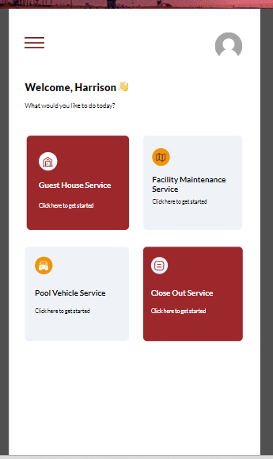

# Estate Manager Project Solution

# Estate Manager (V1.0.0)

This repository contains the solution for the Estate Manager Canvas App (Power Apps). See below the services and screens of the business application.

The codes were optimized for speed, stability, reusability, and efficiency.

# Welcome screen
This screen is the initial screen you will see when open the app. This shows the available services to interact with. It contains 4 services; however, the close-out service is only available to the Estate Teams/ facility management team.

   

# Guest House Service

Guest house service: This service allows you to create and view guest house requests/bookings.

Guest house booking: This allows you to create a new booking request after agreeing to the booking guidelines.

N: B:  Enter all fields correctly. The email address of your line manager, HOD, or HRBP must be error-free and valid.
Check the “Are you booking for a staff?” checkbox and enter the staff details or name if you want to book for a staff.

Click proceed to preview details.

Click the “submit request” button to submit the request. If you noticed a mistake or an error, click the “Edit” button to enter the correct data. If successful, you will be notified. Moreso, if your request failed for some reasons, you will also be notified.

Email Notification: You will receive an email from TSL Service  Account notifying you of the newly created request. An approval request will be sent to your line manager/HRBP/HOD, the response will be  communicated to you via email as soon as it is responded to. Find sample email below:

Line manager/HOD/HRBP Approval: Find sample email below:

As soon as the Estate team approves your request, you will be notified.

Booking requests: Click this button to view requests. Take note of your ID.

Facility maintenance service

This service allows you to create a facility maintenance request and view the request and the request history.

Create a request: Fill the required fields and click proceed to preview entries before submitting.

Email Notification: You will receive an email from TSL Service  Account notifying you of the newly created facility request. An approval request will be sent to the Estate team for action. The person in charge of that request based on the work location will respond to the request. And the response will be communicated to you via email. 

Newly created request remains pending until it is approved or rejected.

Find sample email below:

View Request: Click view request to view list of your requests:

Estate Team Approval: The approver (approved by) is the person that is responsible for issues regarding the location where the issue was reported. Find sample email below:

Request History: View requests based on the status of the request.

Click on the request to view more details about that request. N:B, Approved request cannot be deleted. You can edit and update records that have not been approved. 

Pool Vehicle Service

Pool vehicle service: This is where you create new trip request, extend existing trips, and view trip and trip extension requests. 

New trip request: This is where you create new trip request. Fill in the required field appropriately, Click Proceed to preview your data. And submit.

You will receive an email.

You will also receive an approval response from your Line manager/HOD/HRBP

You will then receive an approval response from the Estate Team

Trip extension: You can extend existing trips using the trip ID. Click Proceed to preview data after filling the required fileds. Then submit. 

After a successful submission, your HRBP/Line manager/HOD will approve, then the Estate team. You will receive email notifications for all responses.

Trip request: To view all your new trip request. You can download the list by clicking the PDF icon.

Trip Ext Request: To view extended trip request.

Close out service - (Estate Team)

Closeout service: This service is only available to the Estate Management team. 

Close out request: To close out facility maintenance request using the ID. Fill out the required fields. Click Proceed to preview data. Then submit. 

 

The person that created the facility request and the team will be notified when a request is closed.

The End
